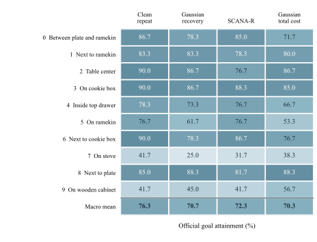
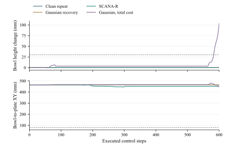

# LIBERO-Spatial: ten-task results and reviewer access

Four methods × three paired library/policy repetitions × ten official Spatial tasks × twenty test initial states = **2,400 formal test episodes**.
The policy is a compact RGB/proprioception/instruction-conditioned model trained from scratch.
This custom multitask experiment does not evaluate all LIBERO suites, the default lifelong protocol,
a pretrained foundation VLA, CALVIN or SimplerEnv.

## Results

| Method | Macro success (%) | SD across repetitions |
|---|---:|---:|
| Repeated original data | 76.3 | 4.2 |
| Correlated Gaussian recovery | 70.7 | 4.5 |
| SCANA-R | 72.3 | 4.5 |
| Gaussian, matched total active wall time | 70.3 | 3.5 |

SD uses three paired recovery-library/policy repetitions, not 2,400 independent training fits.
The point estimate for SCANA-R is below original repetition. The paired comparisons do not establish
a stable calibration advantage. Original demonstrations remain fixed; active wall time is not energy use.

<figure><figcaption>Figure 10 · All ten tasks and three paired repetitions. <a href="assets/figures/figure-10.pdf">Vector PDF</a>.</figcaption></figure>
<figure><figcaption>Figure 11 · Failure proxies and cost accounting. These descriptive proxies do not identify causal failure mechanisms. <a href="assets/figures/figure-11.pdf">Vector PDF</a>.</figcaption></figure>

## Review and recompute

Download the small reviewer ZIP below and run `python recompute_statistics.py`.
It uses only the Python standard library, validates 2,400 unique rows and 120 groups,
and recomputes task rates, repetition SD, paired differences, failure-proxy counts and recorded costs.
From a repository clone, the equivalent command is `python scripts/reproduce_libero.py`;
`python scripts/reproduce.py` now also includes this extension and keeps the older batches separate.

## Downloadable evidence

- [SCANA-R-LIBERO-Spatial-review-v1.zip](https://github.com/2254257831/SCANA-R/releases/download/libero-spatial10-v1/SCANA-R-LIBERO-Spatial-review-v1.zip) — 0.62 MB. Small standalone reviewer statistics package; Python standard library only.
- [SCANA-R-LIBERO-Spatial-evaluation-models-v1.zip](https://github.com/2254257831/SCANA-R/releases/download/libero-spatial10-v1/SCANA-R-LIBERO-Spatial-evaluation-models-v1.zip) — 523.94 MB. All formal evaluation traces, final/auxiliary models, error banks, protocol and fixed-ID clips; warm-up records explicitly separate.
- [SCANA-R-LIBERO-Spatial-recovery-lib101-gaussian-v1.zip](https://github.com/2254257831/SCANA-R/releases/download/libero-spatial10-v1/SCANA-R-LIBERO-Spatial-recovery-lib101-gaussian-v1.zip) — 387.72 MB. Complete lib101_gaussian recovery library, cameras, rollouts and observation-action audits.
- [SCANA-R-LIBERO-Spatial-recovery-lib101-scana-r-v1.zip](https://github.com/2254257831/SCANA-R/releases/download/libero-spatial10-v1/SCANA-R-LIBERO-Spatial-recovery-lib101-scana-r-v1.zip) — 387.01 MB. Complete lib101_scana_r recovery library, cameras, rollouts and observation-action audits.
- [SCANA-R-LIBERO-Spatial-recovery-lib202-gaussian-v1.zip](https://github.com/2254257831/SCANA-R/releases/download/libero-spatial10-v1/SCANA-R-LIBERO-Spatial-recovery-lib202-gaussian-v1.zip) — 387.65 MB. Complete lib202_gaussian recovery library, cameras, rollouts and observation-action audits.
- [SCANA-R-LIBERO-Spatial-recovery-lib202-scana-r-v1.zip](https://github.com/2254257831/SCANA-R/releases/download/libero-spatial10-v1/SCANA-R-LIBERO-Spatial-recovery-lib202-scana-r-v1.zip) — 387.64 MB. Complete lib202_scana_r recovery library, cameras, rollouts and observation-action audits.
- [SCANA-R-LIBERO-Spatial-recovery-lib303-gaussian-v1.zip](https://github.com/2254257831/SCANA-R/releases/download/libero-spatial10-v1/SCANA-R-LIBERO-Spatial-recovery-lib303-gaussian-v1.zip) — 388.02 MB. Complete lib303_gaussian recovery library, cameras, rollouts and observation-action audits.
- [SCANA-R-LIBERO-Spatial-recovery-lib303-scana-r-v1.zip](https://github.com/2254257831/SCANA-R/releases/download/libero-spatial10-v1/SCANA-R-LIBERO-Spatial-recovery-lib303-scana-r-v1.zip) — 387.77 MB. Complete lib303_scana_r recovery library, cameras, rollouts and observation-action audits.

[Archive SHA-256 values](assets/libero-spatial10-SHA256SUMS.txt) · [Machine-readable manifest](assets/libero-spatial10-downloads.json)

Extract the evaluation/model ZIP and desired recovery ZIPs into the same directory;
their common root is `libero_spatial10/`. Each archive contains a per-file SHA-256 manifest.
All 2,400 formal traces, six recovery libraries including newly captured camera arrays,
12 final policies, 15 auxiliary fold models, collection attempts, costs and audits are included.
Warm-up records are explicitly separated. Fixed-ID recorded clips are in the evaluation/model archive;
they do not replace the aggregate statistics. The separate 720-episode pilot is not pooled and remains local.

## Protocol and limitations

Each task uses 40 source training episodes and 10 development episodes; test initial states
are separate. Five-fold auxiliary fitting excludes the source episode used for error calibration.
Library/policy seed pairs are 101/7, 202/11 and 303/23. The frozen horizon is 600 steps.
Evaluation pairing checks dynamic state, fixed object poses, initial images and proprioception.
The archive records evaluation-only memory repairs and a paired rerun of twelve discrepant image hashes;
the old pixels were unavailable, so the cause of that discrepancy is unresolved.
No method or training budget was changed in these evaluation repairs.

The compact package includes exact executed core sources, environment versions, upstream commits
and the official dataset source. Original LIBERO demonstrations and third-party assets are not
redistributed here. Obtain them from the pinned official links. Full collection/training has not
been repeated on another machine; the independently checked workflow is the statistics reanalysis.
Only local metadata paths were normalized in checkpoints; all tensor storage and numerical arrays
were preserved and all 28 model files loaded successfully on CPU.

The manuscript full text and private physical-robot materials remain unpublished.
The visible hosting account and retained Git history mean this site is not fully anonymous.
